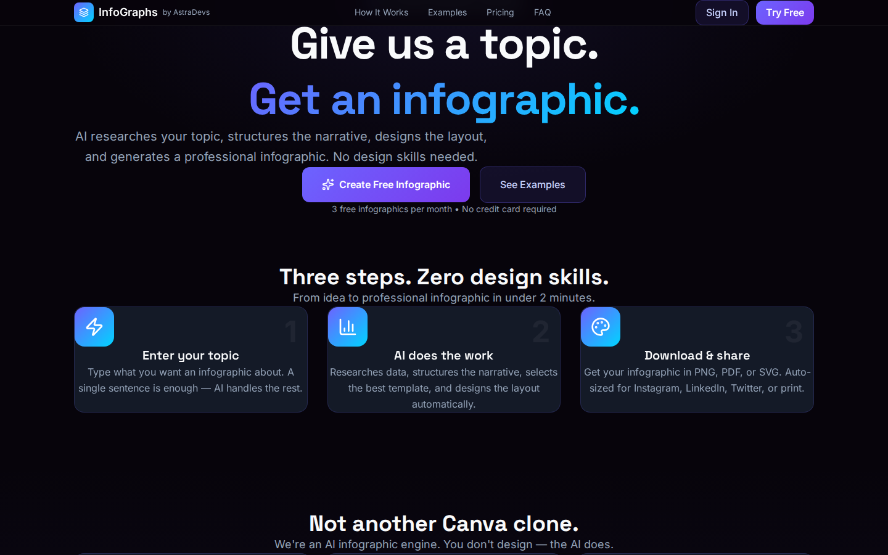
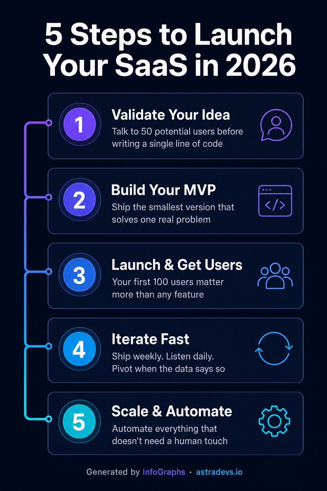
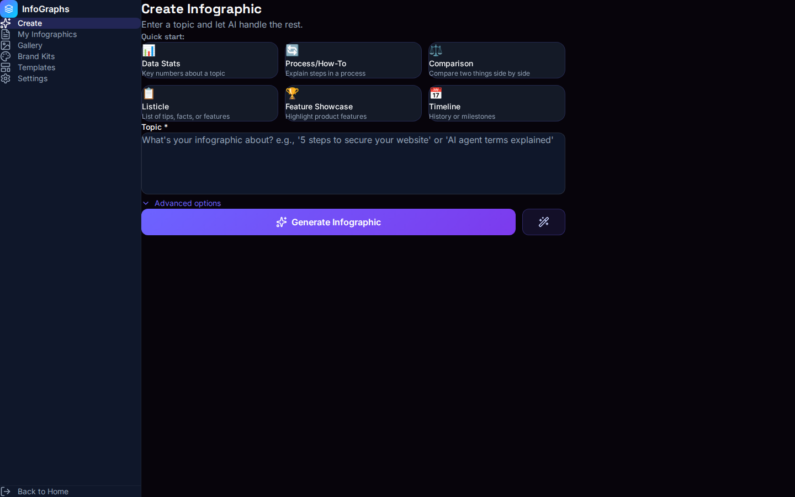
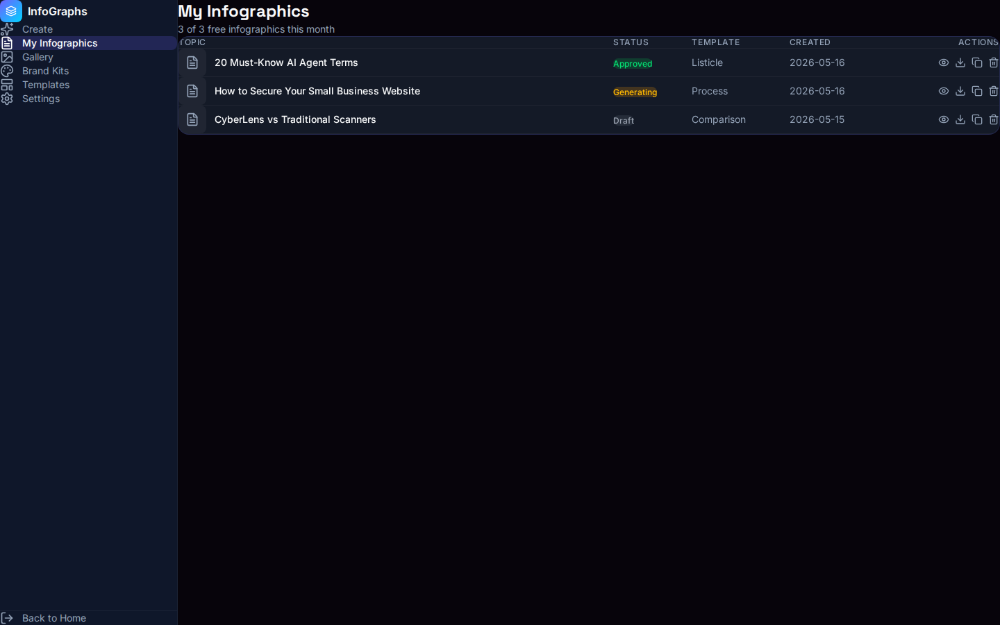
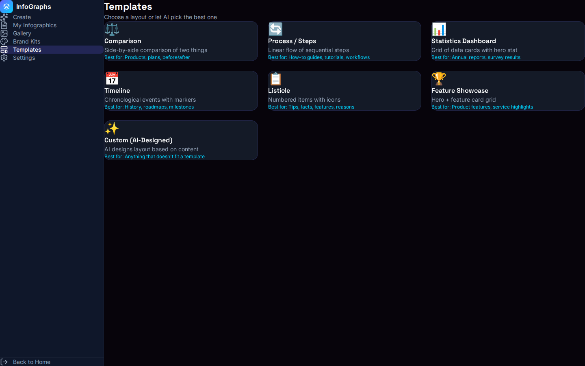
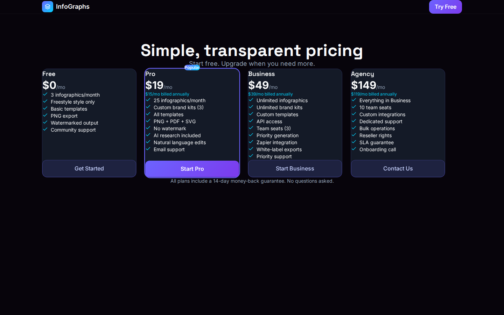

<div align="center">

# 🎨 InfoGraphs

### AI-Powered Infographic Generator

**Give us a topic. Get a professional infographic.**

[](https://infographs-astradevs.vercel.app)
[](./LICENSE)
[](https://github.com/shadoprizm/infographs-astradevs/stargazers)

[Live Demo](https://infographs-astradevs.vercel.app) · [Report Bug](https://github.com/shadoprizm/infographs-astradevs/issues) · [Request Feature](https://github.com/shadoprizm/infographs-astradevs/issues)

</div>

---

## 🖼️ What It Looks Like

### Landing Page


### AI-Generated Sample Infographic


*This infographic was 100% AI-generated from a single topic prompt. No design tools. No templates. Just AI.*

### App Dashboard
<table>
<tr>
<td width="50%"></td>
<td width="50%"></td>
</tr>
<tr>
<td align="center"><b>Create Page</b> — Enter a topic, AI does the rest</td>
<td align="center"><b>My Infographics</b> — Track every generation</td>
</tr>
</table>

<table>
<tr>
<td width="50%"></td>
<td width="50%"></td>
</tr>
<tr>
<td align="center"><b>Templates</b> — 7 layout types + AI-designed</td>
<td align="center"><b>Pricing</b> — Free tier included</td>
</tr>
</table>

---

## ⚡ What Is InfoGraphs?

InfoGraphs is an **AI-native infographic engine**. It's not a design tool — it's a generation engine.

You type a topic like *"5 cybersecurity stats for 2026"* or *"How to secure a small business website"*, and the AI:

1. **🔍 Researches** your topic — finds real data, statistics, and facts
2. **📝 Structures** a compelling visual narrative
3. **🎨 Designs** the layout from 7 template types (or creates a custom one)
4. **🖼️ Generates** a professional infographic
5. **✏️ Revises** based on your natural language feedback

No Canva. No Figma. No drag-and-drop. Just AI doing what designers do — but in 60 seconds instead of 6 hours.

---

## 🌟 Key Features

| Feature | Description |
|---------|-------------|
| **AI Research** | Don't have data? AI researches your topic, finds stats, validates sources |
| **Smart Narrative** | Structures content into hook → substance → takeaway for maximum engagement |
| **Brand Consistency** | Upload your brand kit once — every infographic matches your colors, fonts, style |
| **Natural Language Edits** | "Make it darker" · "Add more stats" · "Try a different layout" — plain English revisions |
| **Multi-Platform Export** | Auto-generates Instagram, LinkedIn, Twitter/X, and print-optimized versions |
| **7 Template Types** | Comparison, Process, Stats Dashboard, Timeline, Listicle, Feature Showcase, Custom AI-designed |
| **API Access** | Generate infographics programmatically from your own apps (Business+ plan) |

---

## 🧰 Tech Stack

| Layer | Tech |
|-------|------|
| **Frontend** | [React](https://react.dev) + [TypeScript](https://typescriptlang.org) + [Tailwind CSS](https://tailwindcss.com) + [Vite](https://vitejs.dev) |
| **Backend** | [OCC Nexus](https://github.com/shadoprizm/openclaw) Infographic Pipeline (Python/FastAPI) |
| **Auth** | [Clerk](https://clerk.com) |
| **Payments** | [Stripe](https://stripe.com) |
| **AI** | GPT Image 2 (creative) + HTML/SVG→PNG (data-precise) |
| **Hosting** | [Vercel](https://vercel.com) (frontend) + Self-hosted (backend) |

---

## 🚀 Getting Started

### Prerequisites

- Node.js 18+
- npm or yarn

### Install & Run

```bash
# Clone the repo
git clone https://github.com/shadoprizm/infographs-astradevs.git
cd infographs-astradevs

# Install dependencies
npm install

# Start development server
npm run dev

# Build for production
npm run build
```

The app will be running at `http://localhost:5173`.

> **Note:** The frontend connects to the OCC Nexus backend API at `http://192.168.0.86:8080/api/infographic` by default. To point it at your own backend, update the proxy target in `vite.config.ts`.

---

## 📁 Project Structure

```
infographs-astradevs/
├── public/
│   └── favicon.svg
├── src/
│   ├── layouts/
│   │   └── AppLayout.tsx          # Dashboard shell with sidebar nav
│   ├── pages/
│   │   ├── LandingPage.tsx        # Marketing landing page
│   │   ├── PricingPage.tsx        # 4-tier pricing
│   │   └── app/
│   │       ├── CreatePage.tsx     # Topic input + AI generation
│   │       ├── BriefsPage.tsx     # User's infographic list
│   │       ├── BriefDetailPage.tsx # Preview + revision flow
│   │       ├── GalleryPage.tsx    # Completed infographic gallery
│   │       ├── BrandKitsPage.tsx  # Brand kit manager
│   │       ├── TemplatesPage.tsx  # 7 template browser
│   │       └── SettingsPage.tsx   # Account + subscription
│   ├── index.css                  # Dark theme + design tokens
│   └── main.tsx                   # Router + app entry
├── docs/
│   └── screenshots/               # README screenshots + samples
├── index.html
├── vite.config.ts
├── vercel.json
└── package.json
```

---

## 💰 Pricing

| Tier | Price | Infographics/mo | Highlights |
|------|-------|-----------------|------------|
| **Free** | $0 | 3 | Freestyle designs, PNG export, watermarked |
| **Pro** | $19/mo | 25 | Brand kits, all templates, PNG+PDF+SVG, no watermark, AI research |
| **Business** | $49/mo | Unlimited | API access, team seats, priority generation, Zapier |
| **Agency** | $149/mo | Unlimited | 10 seats, white-label, reseller rights, SLA, onboarding call |

All plans include a 14-day money-back guarantee.

---

## 🤝 Contributing

We love contributions! InfoGraphs is open source for a reason.

### Quick Start

1. **Fork** the repository
2. **Create** a feature branch: `git checkout -b feature/amazing-feature`
3. **Commit** your changes: `git commit -m 'Add amazing feature'`
4. **Push** to your branch: `git push origin feature/amazing-feature`
5. **Open** a Pull Request

### Areas We Need Help

- 🎨 More template designs
- 🌐 Internationalization (i18n)
- 🧪 Test coverage
- 📱 Mobile app (React Native)
- 🔌 Plugin system for custom data sources
- ♿ Accessibility improvements

---

## 🗺️ Roadmap

- [x] Landing page + marketing site
- [x] App dashboard with all views
- [x] Dark theme + responsive design
- [x] Vercel deployment
- [ ] Clerk auth integration
- [ ] Stripe checkout flow
- [ ] Live API connection to OCC pipeline
- [ ] Real-time generation progress (WebSocket)
- [ ] Template editor (drag-and-drop)
- [ ] Team collaboration features
- [ ] Zapier integration
- [ ] REST API documentation
- [ ] Mobile-responsive app views
- [ ] Analytics dashboard (usage, popular topics)

---

## 🏗️ Architecture

```
┌─────────────────┐     ┌──────────────────────────────┐
│   Vercel (CDN)   │────▶│   React SPA                  │
│   Frontend       │     │   Vite + TS + Tailwind        │
└─────────────────┘     └──────────┬───────────────────┘
                                   │ /api/*
┌──────────────────────────────────▼───────────────────┐
│   OCC Nexus Backend (FastAPI)                         │
│   ┌──────────┐ ┌──────────┐ ┌──────────┐ ┌────────┐ │
│   │ Briefs   │ │ Pipeline │ │ Gallery  │ │Exports │ │
│   │ Manager  │ │ Engine   │ │ Storage  │ │Service │ │
│   └────┬─────┘ └────┬─────┘ └──────────┘ └────────┘ │
│        │             │                                 │
│   ┌────▼─────┐ ┌────▼─────┐                          │
│   │ AI Research│ │ GPT Image│                          │
│   │ Agent     │ │ Generator│                          │
│   └──────────┘ └──────────┘                          │
└──────────────────────────────────────────────────────┘
```

---

## 📄 License

This project is licensed under the **MIT License** — see [LICENSE](./LICENSE) for details.

Free to use, modify, and distribute. Build something amazing.

---

## 🔗 Links

- **🌐 Live Site:** [infographs-astradevs.vercel.app](https://infographs-astradevs.vercel.app)
- **📂 GitHub:** [github.com/shadoprizm/infographs-astradevs](https://github.com/shadoprizm/infographs-astradevs)
- **🏠 AstraDevs:** [astradevs.io](https://astradevs.io)
- **💻 Made by:** [shadoprizm](https://github.com/shadoprizm)

---

<div align="center">

**If you like this project, give it a ⭐ — it helps others find it.**

[](https://github.com/shadoprizm/infographs-astradevs/stargazers)

Built with ☕ and AI by [North Star Holdings](https://github.com/shadoprizm) · [AstraDevs](https://astradevs.io)

</div>
